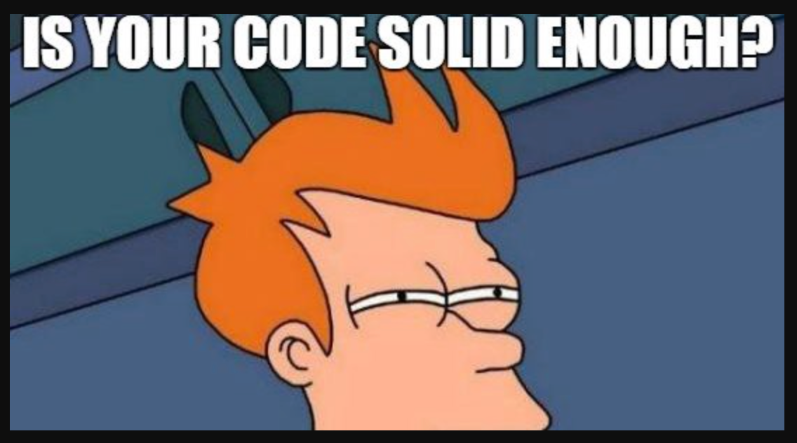

# SOLID

This is a [Great Video](https://www.youtube.com/watch?v=q1qKv5TBaOA) about SOLID principles. Give it a try. 

SOLID principles are five rules that software developers follow to make their code more organized, readable, and maintainable. They are:

* **Single Responsibility Principle (SRP):** A class should have only one responsibility. This means that it should only do one thing and do it well. For example, a class that draws a circle should only draw circles, and it shouldn't also be responsible for calculating the area of the circle or finding the circumference.
* **Open-Closed Principle (OCP):** A class should be open for extension but closed for modification. This means that you should be able to add new features to a class without having to change the existing code. For example, if you want to add a new shape to a class that draws shapes, you should be able to do so without having to change the code that draws the existing shapes.
* **Liskov Substitution Principle (LSP):** Objects of a subclass should be substitutable for objects of their parent class. This means that if you have a class called `Animal` and a subclass called `Dog`, you should be able to use a `Dog` object anywhere you would use an `Animal` object. For example, if you have a function that takes an `Animal` object as a parameter, you should be able to pass a `Dog` object to that function without any problems.
* **Interface Segregation Principle (ISP):** Don't put too many methods in an interface. This means that you should create separate interfaces for different groups of methods. For example, if you have an interface for shapes, you might want to create separate interfaces for two-dimensional shapes and three-dimensional shapes. This will make it easier for developers to use the right methods for the shapes they are working with.
* **Dependency Inversion Principle (DIP):** High-level modules should not depend on low-level modules. Instead, both should depend on abstractions. This means that you should create abstract classes or interfaces that define the behavior of the different modules in your code. Then, the high-level modules can depend on these abstractions, and the low-level modules can implement the abstractions. This will make your code easier to understand and maintain.

## If you have less brain cells to understand (like me), this can make you feel better

Yes, we exist. With less number of brain cells and a single dopamine molecule helping us with the day. Nonetheless, this is actually great

* **Single Responsibility Principle (SRP):** Let's say you have a toy car that can drive, honk its horn, and light up its headlights. This toy car has three responsibilities: driving, honking, and lighting up its headlights. If you wanted to add a new responsibility to the toy car, such as making it talk, you would have to change the code for one of the existing responsibilities. This is because the toy car is not following the SRP. A better way to design the toy car would be to have three separate toys: one for driving, one for honking, and one for lighting up the headlights. This way, you could add new responsibilities to each toy without having to change the code for the other toys.
* **Open-Closed Principle (OCP):** Let's say you have a toy box that can hold different types of toys. The toy box is open for extension because you can add new types of toys to it without having to change the code for the toy box. For example, you could add a new shelf to the toy box to hold larger toys. The toy box is closed for modification because you shouldn't have to change the code for the toy box just because you add a new type of toy.
* **Liskov Substitution Principle (LSP):** Let's say you have a toy train that can move around on tracks. You also have a toy car that can move around on roads. These two toys are different, but they are both objects that can move. This means that they are substitutable for each other. For example, you could use a toy train in a game where you are supposed to move a toy around on tracks. The toy train is a valid substitute for the toy car in this game because they both can move.
* **Interface Segregation Principle (ISP):** Let's say you have a toy robot that can walk, talk, and shoot lasers. These three abilities are different, so they should be defined in separate interfaces. For example, you could have an interface for walking, an interface for talking, and an interface for shooting lasers. This way, the toy robot can only implement the interfaces that it needs. This makes the toy robot easier to understand and maintain.
* **Dependency Inversion Principle (DIP):** Let's say you have a toy house that is made up of different rooms. The rooms in the house depend on each other. For example, the kitchen depends on the pantry to get food, and the bathroom depends on the water heater to get hot water. This is a good example of the DIP because the rooms in the house are dependent on abstractions. The pantry is an abstraction of a place to store food, and the water heater is an abstraction of a place to get hot water. This makes the toy house easier to understand and maintain.
