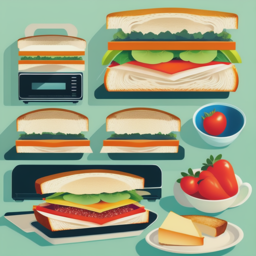

# Facade



Imagine you are a child and you want to make a sandwich. You need to get bread, meat, cheese, and vegetables from the fridge, and you need to use the toaster and the microwave. But you don't know how to use any of these things.

The facade pattern is like that. It provides a simple interface to a complex system. In this case, the complex system is the kitchen, and the facade is the sandwich maker. The sandwich maker knows how to use all the appliances in the kitchen, so you don't have to.

In JavaScript, you can implement a facade using a class. The facade class would have methods for interacting with the different appliances in the kitchen. For example, it might have a method for making a sandwich, a method for making a grilled cheese sandwich, and a method for making a quesadilla.

Here is an example of how to implement a facade using a class in JavaScript:

```js
class KitchenFacade {
    constructor(toaster, microwave) {
        this.toaster = toaster
        this.microwave = microwave
    }

    makeSandwich() {
        this.toastBread()
        this.addMeat()
        this.addCheese()
        this.addVegetables()
        return this.toastBread()
    }

    makeGrilledCheeseSandwich() {
        this.toastBread()
        this.addCheese()
        this.microwaveSandwich()
        return this.toastBread()
    }

    makeQuesadilla() {
        this.heatTortilla()
        this.addMeat()
        this.addCheese()
        this.microwaveSandwich()
        return this.heatTortilla()
    }

    toastBread() {
        this.toaster.toastBread()
    }

    microwaveSandwich() {
        this.microwave.microwaveSandwich()
    }

    heatTortilla() {
        this.microwave.heatTortilla()
    }
}

const kitchenFacade = new KitchenFacade(new Toaster(), new Microwave())

console.log(kitchenFacade.makeSandwich()) // "toasted sandwich"
console.log(kitchenFacade.makeGrilledCheeseSandwich()) // "grilled cheese sandwich"
console.log(kitchenFacade.makeQuesadilla()) // "quesadilla"
```

In this code, the `KitchenFacade` class is the facade. It has methods for interacting with the toaster, the microwave, and the tortilla warmer. The `makeSandwich()` method calls the `toastBread()` method, the `addMeat()` method, the `addCheese()` method, the `addVegetables()` method, and the `toastBread()` method again. The `makeGrilledCheeseSandwich()` method calls the `toastBread()` method, the `addCheese()` method, and the `microwaveSandwich()` method. The `makeQuesadilla()` method calls the `heatTortilla()` method, the `addMeat()` method, the `addCheese()` method, and the `microwaveSandwich()` method.

The facade pattern allows us to simplify the interface to a complex system. This can be useful when we want to make the system easier to use, or when we want to hide the complexity of the system from the user.